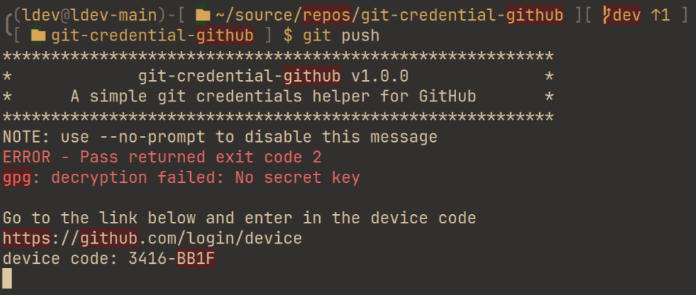

<p align="center">
  
</p>

A simple git [credentials helper](https://git-scm.com/docs/gitcredentials) for GitHub




# Features
* Its way less bloated than [Git Credential Manager](https://github.blog/2022-04-07-git-credential-manager-authentication-for-everyone)
* It relays to another credential helper. So you can use standard credential helpers with GitHub

# Install

## Debian/Ubuntu
Download the .deb from the [latest release](https://github.com/xgames123/git-credential-github/releases/latest) and run ```dpkg -i file_you_just_downloaded.deb```

## Arch linux
Install git-credential-github form the AUR. [ArchLinux wiki](https://wiki.archlinux.org/title/Arch_User_Repository#Installing_and_upgrading_packages)

# Configuring
```~/.gitconfig```
```ini
[credential "https://github.com"]
  helper = github -b 'cache --timeout=86400'
```
This sets the credential helper for github using the cache helper with a timeout of 1 day

## More examples

### Set only for repos owned by you
```~/.gitconfig```
```ini
[credential]
	useHttpPath = true
[credential "https://github.com/Xgames123"] # change to your name
  username=Xgames123 # change to your name
  helper = github -b 'cache --timeout=86400'
```

### Using pass to store your credentials
Install [git-credential-pass](https://github.com/Xgames123/git-credential-pass)
```~/.gitconfig```
```ini
[credential "https://github.com"]
  helper = github -b 'pass -p git/{host}/{username} -t ~/.config/git-credential-pass/default.template'
```
See [git-credential-pass](https://github.com/Xgames123/git-credential-pass) for more info

# Bug or Error
If you find a bug, get an error or the docs are wrong.
* [Create an issue](https://github.com/Xgames123/git-credential-github/issues/new/)
* Message me <[ldev@ldev.eu.org](mailto://ldev@ldev.eu.org)>
* Message me on discord [ldev105](https://ldev.eu.org/socials/discord)


# Building debian packages from source
1. install [reltools](https://github.com/Xgames123/reltools)
2. run makepkg_deb inside the packaging directory
