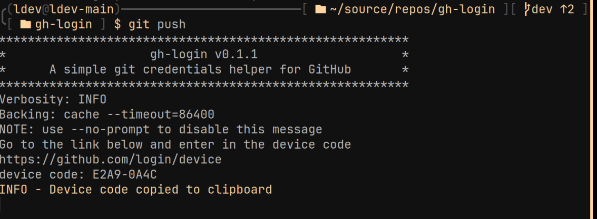

<p align="center">
  
</p>

A simple git [credentials helper](https://git-scm.com/docs/gitcredentials) for GitHub




# Features
1. Its way less bloated than [Git Credential Manager](https://github.blog/2022-04-07-git-credential-manager-authentication-for-everyone)
2. It relays to another credential helper. So you can use standard credential helpers with GitHub
## TODO
* Make the 'https://github.com/login/device' auto open using xdg-open
* Auto copy device code to clipboard using wl-clipboard
* Support xclip
* Make an en environment variable to set the backing helper. eg GHLOGIN_BACKINGHELPER
* Support Arch Linux (AUR)
* Support Windows

# Install

## Debian/Ubuntu
1. Download latest release and run ```dpkg -i gh-login.deb``` NOTE: Replace ```gh-login.deb``` with the file you just downloaded
2. Go to [configuring](#Configuring)

## Arch linux
Install gh-login form the AUR
```bash
git clone aur.archlinux.org/gh-login.git
cd gh-login
makepkg --syncdeps --install
```
Or use an aur helper
```bash
yay -S gh-login
```
Go to [configuring](#Configuring)

# Configuring
Set gh-login as your git credential helper for github urls
   
```git config --global credential.https://github.com.helper "gh-login -b 'cache --timeout=86400'"```
   
This will set 'cache' with a timeout of 1 day (86400 seconds) as the backing helper. See https://git-scm.com/docs/gitcredentials


# Bug or Error
If you find a bug, get an error or the docs are wrong.
* [Create an issue](https://github.com/Xgames123/gh-login/issues/new/)
* Message me <[ldev@ldev.eu.org](mailto://ldev@ldev.eu.org)>
* Message me on discord [ldev105](https://ldev.eu.org/socials/discord)
